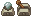

## Ocean's Heart Tips
While I tried to make the demo as self-explanatory as I could, I built it quickly over a long weekend.
There are a couple things I think are obvious in the main game, but due to the demo's compressed nature,
are perhaps a little less obvious.

### Controls
You can view the controls by opening the menu (D on a keyboard and start on a gamepad),
and scrolling over with the arrow keys or joystick to the status subscreen of the menu.
Below "save and "quit" is "controls", which lays them all out.

### Obstacles
There's a few kinds of blocks that can be overcome in specific ways.
 

 
These blocks can be pushed out of the way
 

 
These blocks can be destroyed with bombs
 

 
These can be lifted, but only once you get an item to make yourself strong enough.
 
 

 
Switches can be activated with your sword, or if they're too far away, hit them with your bow.
 

### Walkthrough
- When you start the demo, you'll be given a boat ticket. The boat is in the south east part of town, on the waterfront. Talk to a man in an orange shirt to get on board.
- You'll have to fight some monsters on the boat. The large monster that shoots fire at you can't be damaged. But if you attack its tentacles with your bow or boomerang, it will leave.
- You you arrive on the island, you'll need a sword before you can progress particularly far. The village elder will give you one and make a deal with you. He lives in the north east corner of town. A large bell it outside his home.
- Next, head west out of town across a bridge. Cut down some bushes to progress into a forest. You'll need to find a backpack in the north west corner to help out an NPC. The enemies in this area can be pretty tough, so if you're struggling, perhaps explore elsewhere around the island. Collect berries from berry bushes to heal a little health from the menu. Many enemies will drop collectible items. You can sell these at the shop in town, and then buy more healing items or potions to buff your stats.
- After the forest, You'll need to head north from town, then east through the sunflower field. There are some cracked blocks your bombs will destroy so you can head into the pirate fort.
- You need to hit the switch in the middle of the first room to lower the barricade into the next room. However the same switch needs to be activated again while you're in the second room. You can plant a bomb in the first room and run into the second before it goes off.
- South of the second room, there's a switch to open a new door.
- Defeating enemies to open the path in front of you, you'll find your way into a cave where the Bow is guarded. You can use the bow to hit a switch north of the bridge to open the path forward.
- Next you'll need to head to the northwest part of the island, back through the sunflower field. There's another switch you can only hit with the bow along the north coast. It will open a cave where you find an item that allows you to lift large rocks.
- This will allow you to get into a cave near the forest, north of the windmills. Going through there, you'll find a spear that creates fire.
- Use this spear to light fires inside the statues in front of the tomb east of the beach where you started. The island's boss will be in there.
